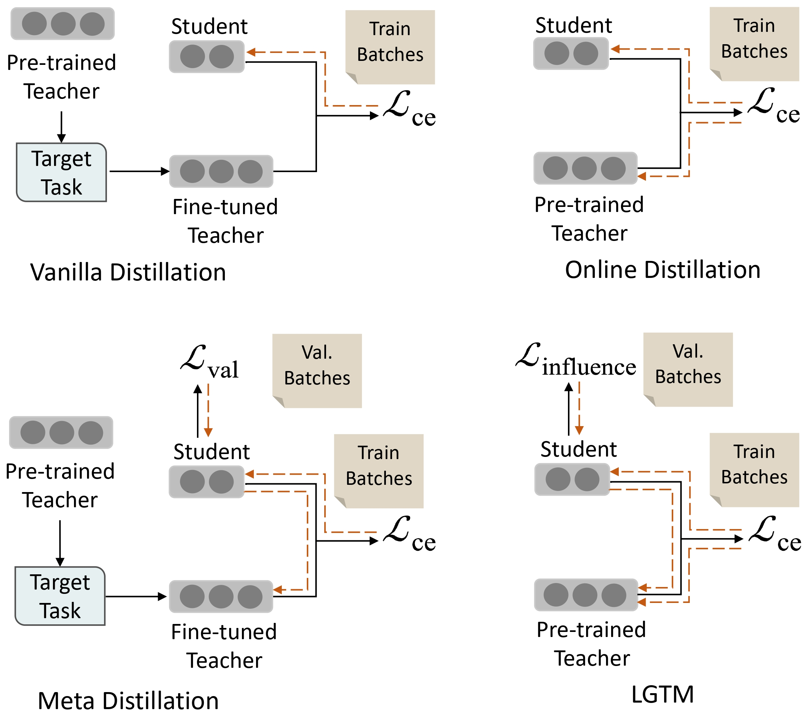

# OPDF

## Introduction

we propose a general **O**ver-**P**arameterization **D**istillation **F**ramework, namely **OPDF**, to improve the performance of knowledge distillation. Given the parameter matrices of a student model, we first over-parameterize them through MPO decomposition and then utilize high-order tensor alignment losses to ensure efficient information transfer.


### Theseus

#### Install the dependencies

```
conda create -n theseus python=3.8

conda activate theseus

pip install torch==1.11.0+cu113 torchvision==0.12.0+cu113 torchaudio\=\=0.11.0 --extra-index-url <https://download.pytorch.org/whl/cu113>

cd LGTM

pip install -r requirements.txt

```


#### Usage

#### Training


### LGTM

#### Install the dependencies

#### Usage

#### Training


### License

Distributed under the Apache 2.0 license. See LICENSE for more information.


# LGTM

✨ \[ACL 2023] This is the official implementation of our  paper : ["Tailoring Instructions to Student’s Learning Levels Boosts Knowledge Distillation"](https://arxiv.org/abs/2305.09651).

## Introduction

We introduce the concept of distillation influence to determine the impact of distillation from each training sample on the student's generalization ability. In this paper, we propose **L**earning **G**ood **T**eacher **M**atters (LGTM), an efficient training technique for incorporating distillation influence into the teacher’s learning process. By prioritizing samples that are likely to enhance the student's generalization ability, our LGTM outperforms 10 common knowledge distillation baselines on 6 text classification tasks in the GLUE benchmark.



### Tab of Content

*   [Installation](#1)

*   [Usage](#2)

    *   [Training](#3)

    *   [Inference](#4)

*   [Results](#5)


### Installation

1.  Clone the repository

    ```sh
    git clone https://github.com/Harry-zzh/LGTM.git
    ```

2.  Install the dependencies

    ```sh
    conda create -n lgtm python==3.8.0

    conda activate lgtm

    pip install torch==1.11.0+cu113 torchvision==0.12.0+cu113 torchaudio==0.11.0 --extra-index-url https://download.pytorch.org/whl/cu113

    cd LGTM

    pip install -r requirements.txt
    ```


### Usage


*

    #### Training

    ```sh
    python run_glue.py \
        --model_name_or_path google/bert_uncased_L-6_H-768_A-12 \
        --teacher_model bert-base-uncased \
        --task_name mnli \
        --per_device_train_batch_size 32 \
        --per_device_eval_batch_size 32 \
        --learning_rate 3e-05 \ # {3e-05,5e-05,1e-04}
        --t_learning_rate 3e-05 \
        --alpha_kd 1.0 \
        --temperature 1.0 \
        --num_train_epochs 6 \
        --output_dir <out_dir> \
        --eval_steps 1000 \
        --do_train \
        --do_eval \
        --train_teacher \
        --init_classifier_to_zero \
        --use_lgtm
    ```

    Hint: You can refer to some baselines using different settings:

    | Model | Setting                                                   |
    | ----- | --------------------------------------------------------- |
    | KD    | (None)                                                    |
    | Prokt | --init\_classifier\_as\_zero --train\_teacher             |
    | LGTM  | --init\_classifier\_as\_zero --train\_teacher --use\_lgtm |


*

    #### Inference

    ```sh
    python run_glue.py \
        --model_name_or_path <checkpoint_path> \
        --task_name mnli \
        --per_device_eval_batch_size 32 \
        --output_dir <predict_out_dir> \
        --do_predict
    ```

    You can get the prediction files for each task and submit them into the GLUE test benchmark.


### Results

We give some results on validation set.

| Task          | Dev       |
| ------------- | --------- |
| MNLI (Acc.)   | 83.4      |
| QQP (F1/Acc.) | 91.1/88.0 |

### License

Distributed under the Apache 2.0 license. See LICENSE for more information.

### Cite

If you find it helpful, you can cite our paper in your work.

```sh
@inproceedings{ren2023tailoring,
  title={Tailoring Instructions to Student's Learning Levels Boosts Knowledge Distillation},
  author={Ren, Yuxin and Zhong, Zihan and Shi, Xingjian and Zhu, Yi and Yuan, Chun and Li, Mu},
  booktitle={Proceedings of the 61st Annual Meeting of the Association for Computational Linguistics},
  url="https://arxiv.org/abs/2305.09651"
  year={2023}
}
```

